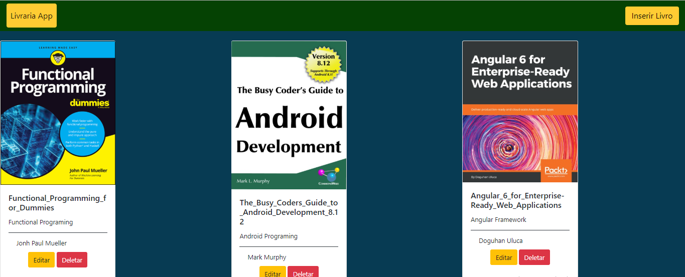

# Livraria App
Aplicação Python Web Utilizando FrameWork Django

Para executar o projeto:

- Crie um virtualenv
    - comando: `python -m venv <NOME_VENV>`

- Após criar a virtualenv, ative através do caminho **<NOME_VENV>/Scripts/activate.bat**

- Instale as dependências do projeto
    - comando: `pip install django`/
               `pip install pillow`

- Faça o **git clone** do projeto

- Na raiz da pasta do projeto, execute o comando **migrate**
    - comando: `python manage.py makemigrations`/ 
               `python manage.py migrate`

- Execute o projeto
    - comando: `python manage.py runserver` 

**OBS: Na pasta media contém imagens que podem ser utilizadas ao cadastrar um livro**
